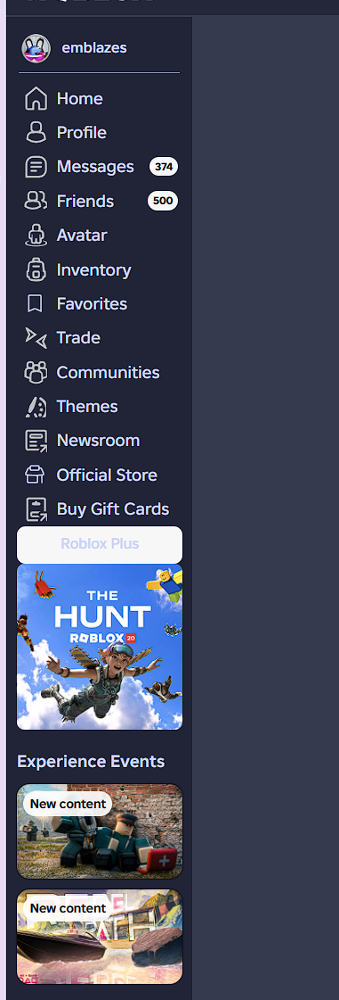

# Roblox Classic Navigation

Restore a classic-style Roblox sidebar while keeping Roblox’s live navigation as the source of truth.

**Status:** Public release · Version 2.0.1

> Independent community userscript. Not affiliated with, endorsed by, or sponsored by Roblox.

## Features

- Restores a classic Roblox sidebar layout.
- Keeps account details, navigation, badges, promotions, and extension sections live.
- Does not collect or transmit data.

## Install with Tampermonkey

1. Install [Tampermonkey](https://www.tampermonkey.net/).
2. Open your browser’s extensions menu, right-click **Tampermonkey**, then select **Manage extension**.
3. Enable **Allow user scripts**.
4. Open [the userscript](https://raw.githubusercontent.com/embz0/roblox-classic-navigation/main/scripts/roblox-classic-navigation.user.js).
5. Select **Install** in Tampermonkey, then refresh [Roblox](https://www.roblox.com/).

## License

[MIT](LICENSE)
